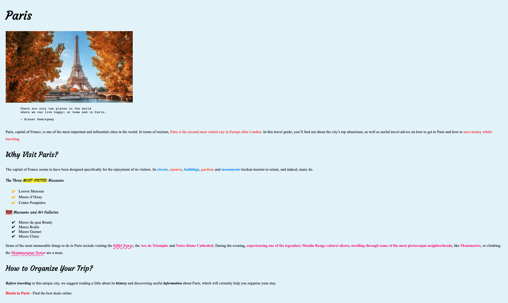

# Exercise

Single webpage about Paris

## Instructions

* Don't forget to add description, keywords, author, favicon in head of document.
* From Google Fonts import "Courgette" in this document
* Add a title to the document
* Use External CSS to style the document
* You can get text from content.txt file
* Body background color will be #e5f4f9
* All headings will have font-family: Courgette, the other content will have font-family: Times New Roman
* ( &#x1F449; ) Emoji hex number : 1F449
* ( &#x2714; ) Emoji hex number : 2714
* Link should open in new Tab and on hover color will change to green
* This is the url link for Hotels in Paris : https://www.introducingparis.com/hotels
* Please just code what you see, neither less nor more.

## The image overview

## The onlive version

In order to see live version, just [click...!](https://hsnakk.github.io/exercise_paris/)